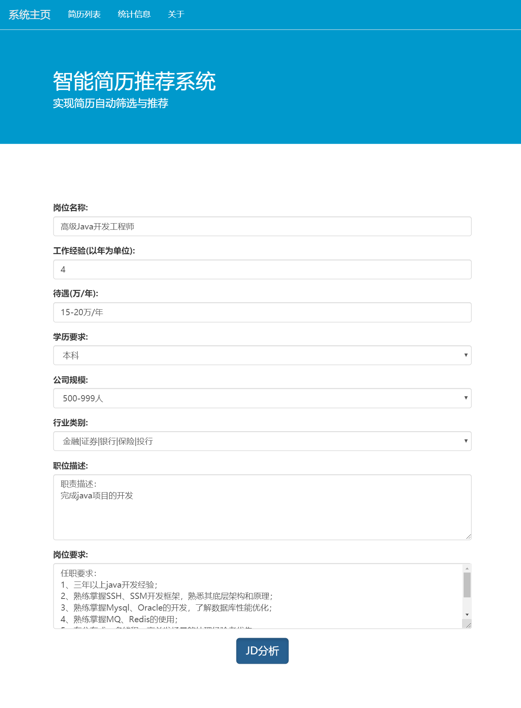
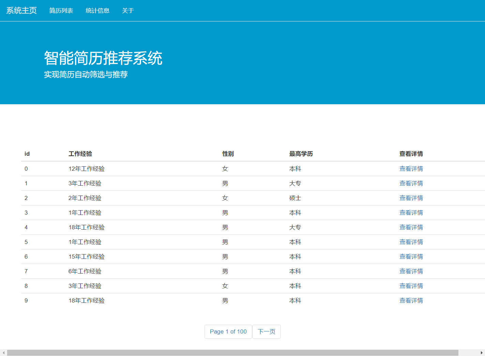
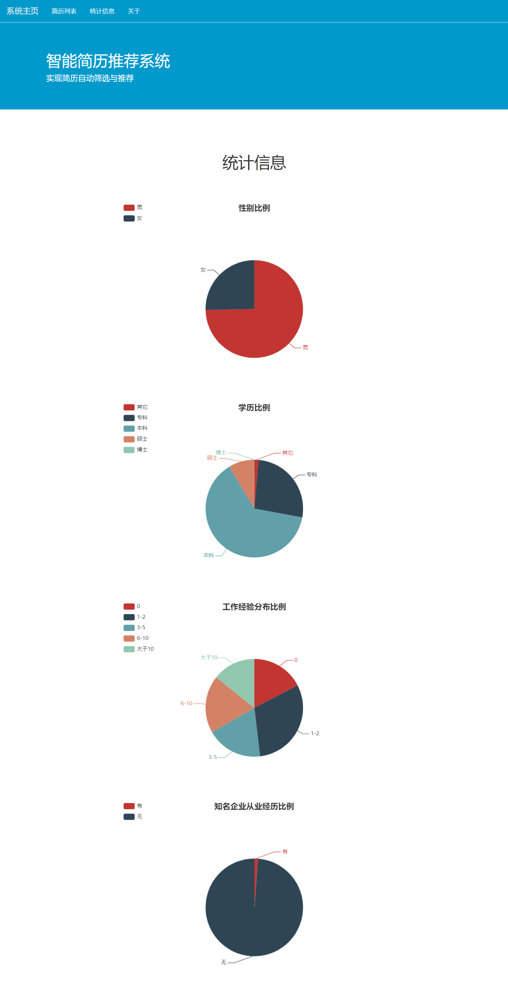
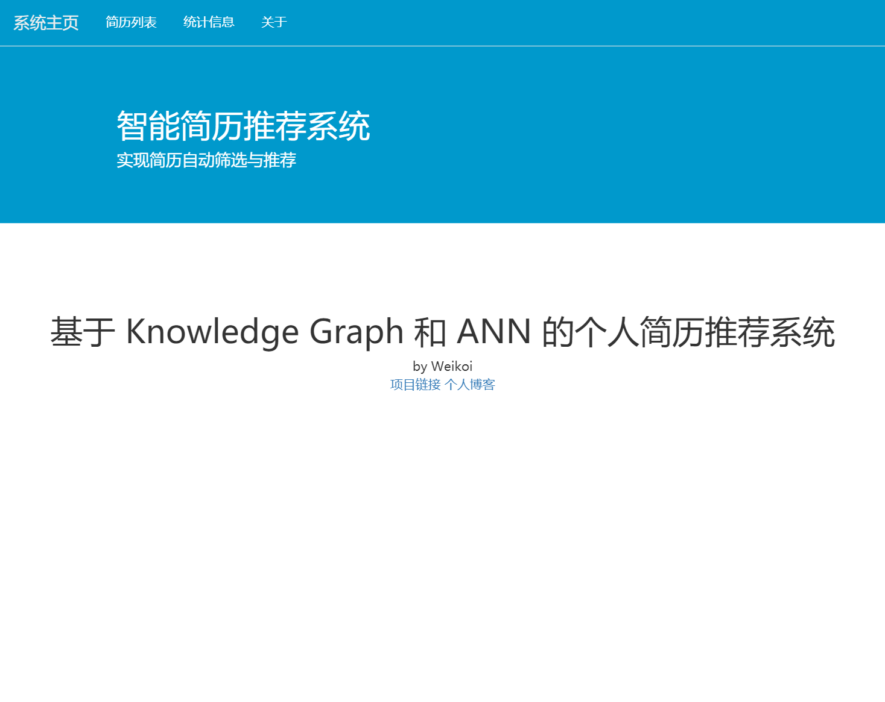
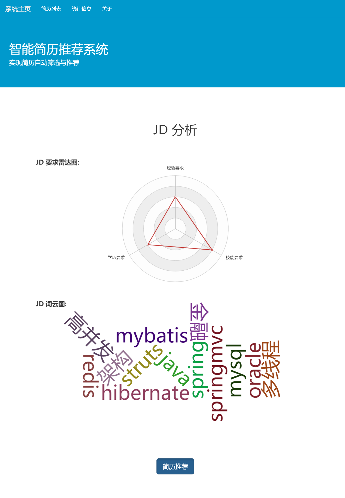
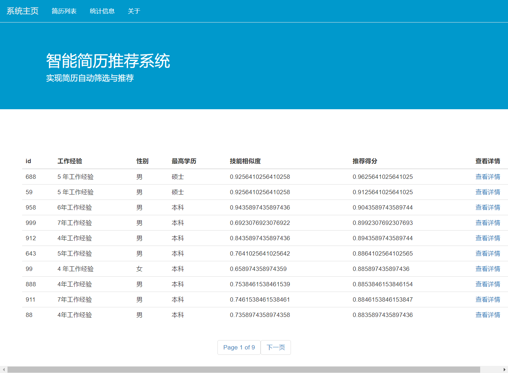

# Resume_Recommender
基于知识图谱与人工神经网络的简历推荐系统

简历相关的资料很多小伙伴发邮件跟我要，这里统一回复：
由于是真实数据集，涉及数据隐私，所以无法提供，非常抱歉。

技术栈前端使用echarts.js（之后有时间会考虑用vue改写一下）, 后端基于Python Django;

特征处理阶段，技能相关特征基于知识图谱处理，图谱构建使用neo4j;

系统的流程是先做二分类筛选，再给分类为正的样本进行排序；

二分类模型基于DNN，基于Keras训练;

排序函数将随机森林的特征重要性作为基础排序指标;

系统演示如下：

<h1>首页</h1>

  

---

<h1>原始简历查看页面</h1>

  

---

<h1>原始简历统计分析图表展示页面</h1>

  

---

<h1>项目简介</h1>

  

---

<h1>招聘信息分析页面</h1>

  

---

<h1>简历推荐结果页面</h1>

  
